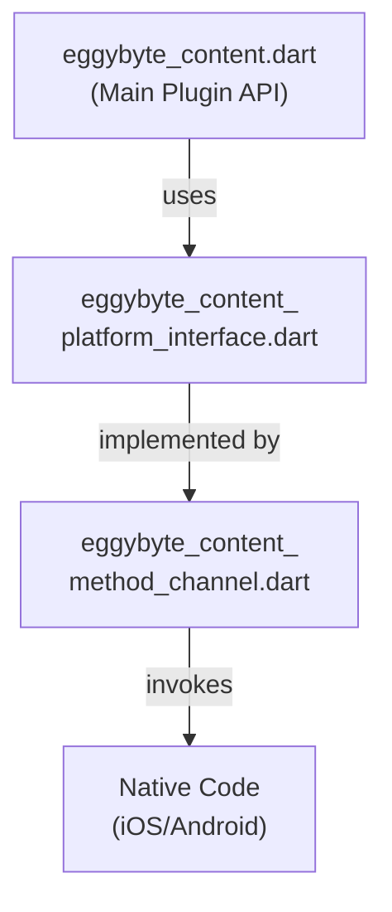

# EggyByte Content Flutter Plugin

<div align="center">
  
  
  
  
  
  
</div>

## 📋 Overview

The `eggybyte_content` Flutter plugin provides a comprehensive Dart interface for integrating Kuaishou SDK to display rich short video content and feeds within Flutter applications. This beta release offers full cross-platform support for both iOS and Android with a modern, type-safe API.

## ✨ Features

### 🎯 Core Functionality
- **Cross-Platform Support**: Native implementations for both iOS and Android
- **Kuaishou SDK Integration**: Complete integration with KS Content SDK for short video feeds
- **KsDualFeedView Widget**: Custom Flutter widget for displaying Kuaishou dual feed content
- **Size Control**: Full support for Flutter's layout constraints and Container wrapping
- **Event System**: Comprehensive event handling for video playback and user interactions

### 📱 Platform-Specific Features

#### iOS (12.0+)
- **KsDualFeedPlatformView**: Native iOS platform view implementation
- **Auto Layout Integration**: Proper constraint-based layout system
- **Event Forwarding**: Complete event delegation from KS SDK to Flutter
- **PluginLogger**: Structured logging with categories and console optimization
- **FlutterCommunicationManager**: Centralized event communication

#### Android (API 21+)
- **Native SDK Integration**: Full Pangle/Kuaishou SDK integration
- **PlatformView Support**: Robust Android platform view implementation
- **Event Broadcasting**: Comprehensive native to Dart event communication
- **Method Channel Handling**: Full method call handling for SDK operations

### 🎨 Example Application
- **Modern Material 3 UI**: Beautiful interface with 3-tab navigation
- **Chinese Localization**: Complete Chinese language support
- **Smart SDK Checking**: Optimized initialization with automatic status monitoring
- **Real-time Events**: Live feed event monitoring and debugging
- **Configuration Display**: SDK parameter visualization and management

### 📊 Event Handling
- **Page Events**: `onPageEnter`, `onPageResume`, `onPagePause`, `onPageLeave`
- **Video Events**: `onVideoPlayStart`, `onVideoPlayPaused`, `onVideoPlayResume`, `onVideoPlayCompleted`, `onVideoPlayError`
- **Share Events**: `onClickShareButton` with content information

## 🏗️ Plugin Architecture

The plugin follows Flutter's standard three-layer architecture pattern:



- **Main Plugin API (`lib/eggybyte_content.dart`)**: Public-facing API with user-friendly widgets and methods
- **Platform Interface (`lib/eggybyte_content_platform_interface.dart`)**: Abstract interface ensuring cross-platform consistency
- **Method Channel (`lib/eggybyte_content_method_channel.dart`)**: Handles communication with native platforms

## 🚀 Getting Started

### 📋 Prerequisites

| Requirement           | Version / Notes                     |
|----------------------|-------------------------------------|
| Flutter              | 3.0+ (with Dart 3.0+)             |
| iOS Deployment       | 12.0+                              |
| Android Compile SDK   | 36                                 |
| Android Min SDK       | 21 (Android 5.0+)                 |
| Kotlin               | 2.1.21                             |

### 🔧 Installation

1. Add `eggybyte_content` to your `pubspec.yaml`:

```yaml
dependencies:
  flutter: 
    sdk: flutter
  eggybyte_content:
    # Replace with your specific version or path
    ^1.0.0-beta
```

2. Install the plugin:

```bash
flutter pub get
```

### ⚙️ Platform Configuration

#### iOS Configuration

1. **Podfile Requirements**: Ensure your iOS deployment target is 12.0+:
```ruby
# ios/Podfile
platform :ios, '12.0'
```

2. **SDK Credentials**: Configure your Kuaishou iOS App ID in your application.

#### Android Configuration

1. **MainActivity Configuration**: Your `MainActivity` **MUST** extend `FlutterFragmentActivity`:

```kotlin
// android/app/src/main/kotlin/.../MainActivity.kt
package com.example.your_app_package

import io.flutter.embedding.android.FlutterFragmentActivity

class MainActivity: FlutterFragmentActivity() {
    // No additional configuration needed
}
```

2. **Permissions**: Add required permissions to `AndroidManifest.xml`:
```xml
<uses-permission android:name="android.permission.INTERNET" />
<uses-permission android:name="android.permission.ACCESS_NETWORK_STATE" />
<!-- Add other permissions as required by Kuaishou SDK -->
```

## 💻 Usage

### 1. Initialize the SDK

```dart
import 'package:eggybyte_content/eggybyte_content.dart';

final _plugin = EggybyteContent();

// Platform-specific App IDs
final String appId = Platform.isAndroid ? "2413800001" : "2413800002";
const String appName = "超能魔盗团";

Future<void> initializeSDK() async {
  try {
    final result = await _plugin.initializeKsSdk(
      ksAppId: appId,
      ksAppName: appName,
    );
    
    if (result != null && result['status'] == true) {
      print('SDK initialized successfully');
    } else {
      print('SDK initialization failed: ${result?['message']}');
    }
  } catch (e) {
    print('SDK initialization error: $e');
  }
}
```

### 2. Set Up Event Listening

```dart
import 'package:eggybyte_content/eggybyte_content.dart';

class MyFeedEventListener extends KsFeedEventListener {
  @override
  void onVideoPlayStart(KsContentItem contentItem) {
    print('Video started: ${contentItem.contentId}');
  }

  @override
  void onPageEnter(KsContentItem contentItem) {
    print('Page entered: ${contentItem.contentId}');
  }

  @override
  void onClickShareButton(String shareInfo) {
    print('Share clicked: $shareInfo');
  }
  
  // Implement other event methods...
}

// Register the listener
final listener = MyFeedEventListener();
_plugin.setKsFeedEventListener(listener);
```

### 3. Display the Feed

```dart
import 'package:eggybyte_content/eggybyte_content.dart';

class FeedPage extends StatelessWidget {
  // Platform-specific Position IDs
  final int posId = Platform.isAndroid ? 24138000629 : 24138000637;

  @override
  Widget build(BuildContext context) {
    return Scaffold(
      body: SafeArea(
        child: KsDualFeedView(
          params: KsDualFeedParams(posId: posId),
        ),
      ),
    );
  }
}
```

### 4. Size Control Examples

The `KsDualFeedView` supports flexible sizing:

```dart
// Fixed size container
Container(
  width: 300,
  height: 400,
  child: KsDualFeedView(
    params: KsDualFeedParams(posId: posId),
  ),
)

// Responsive width with aspect ratio
SizedBox(
  width: MediaQuery.of(context).size.width * 0.8,
  child: AspectRatio(
    aspectRatio: 16 / 9,
    child: KsDualFeedView(
      params: KsDualFeedParams(posId: posId),
    ),
  ),
)

// Full screen
Expanded(
  child: KsDualFeedView(
    params: KsDualFeedParams(posId: posId),
  ),
)
```

## 📁 Project Structure

```
eggybyte_content/
├── android/                    # Android native implementation (Kotlin)
│   └── src/main/kotlin/com/eggybyte/content/
│       ├── EggybyteContentPlugin.kt
│       ├── KsDualFeedFactory.kt
│       ├── KsDualFeedPlatformView.kt
│       └── ... (event listeners and utilities)
├── ios/                        # iOS native implementation (Swift)
│   ├── Classes/
│   │   ├── EggybyteContentPlugin.swift
│   │   ├── KsDualFeedPlatformView.swift
│   │   ├── FlutterCommunicationManager.swift
│   │   ├── PluginLogger.swift
│   │   └── ... (other iOS implementations)
│   └── Resources/
├── lib/                        # Dart API
│   ├── eggybyte_content.dart   # Main public API
│   ├── eggybyte_content_platform_interface.dart
│   ├── eggybyte_content_method_channel.dart
│   └── src/                    # Internal implementations
├── example/                    # Comprehensive example app
│   ├── lib/
│   │   ├── main.dart          # App entry point
│   │   ├── pages/             # Feature pages
│   │   ├── widgets/           # Reusable components
│   │   └── listeners/         # Event handling
│   └── ...
├── CHANGELOG.md               # Version history
├── README.md                  # This file
└── pubspec.yaml              # Package configuration
```

## 🔧 Configuration Details

### Kuaishou SDK Credentials

| Platform | App ID      | Position ID  |
|----------|-------------|--------------|
| Android  | 2413800001  | 24138000629  |
| iOS      | 2413800002  | 24138000637  |

**App Name**: 超能魔盗团

### SDK Versions

| Platform | SDK                    | Version     |
|----------|------------------------|-------------|
| iOS      | KSAdSDK                | 3.3.76.5    |
| Android  | Pangle SDK             | 6.5.1.0     |
| Android  | Pangrowth SDK          | 4.4.0.0     |

## 🐛 Troubleshooting

### Common Issues

1. **iOS Build Errors**: Ensure iOS deployment target is 12.0+
2. **Android Fragment Errors**: Verify MainActivity extends FlutterFragmentActivity
3. **SDK Initialization Fails**: Check App ID and network connectivity
4. **Events Not Received**: Ensure event listener is registered before displaying feed

### Debug Logging

The plugin includes comprehensive logging. On iOS, logs appear in Xcode console with timestamps. On Android, use `adb logcat` to view native logs.

## 📚 Documentation

- **API Reference**: Complete DartDoc documentation for all public APIs
- **Example App**: Comprehensive example demonstrating all features
- **Integration Guide**: Step-by-step setup instructions for both platforms

## 🔄 Version History

See [CHANGELOG.md](CHANGELOG.md) for detailed version history and changes.

## 📜 License

Copyright © 2024-2025 EggyByte Technology. All rights reserved.

This project is proprietary software. No part of this project may be copied, modified, or distributed without the express written permission of EggyByte Technology.

---

<div align="center">
  <p><strong>EggyByte Content Plugin v1.0.0-beta</strong></p>
  <p>Developed by EggyByte Technology • 2024-2025</p>
</div>

修复codesign:
`security unlock-keychain login.keychain`